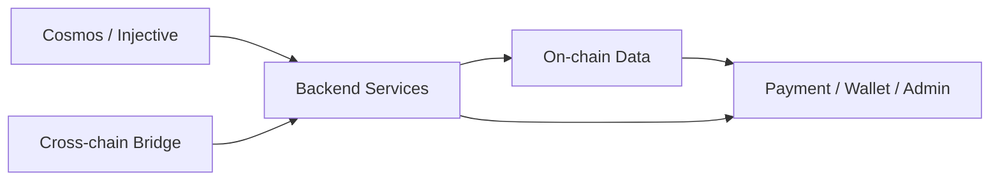

<h1 align="center">Hi, I'm CornersOfTheCity</h1>

<h3 align="center">Web3 Backend Engineer | Cosmos Ecosystem | Smart Contract Integration</h3>

<p align="center">
  <a href="https://github.com/CornersOfTheCity?tab=repositories">
    
  </a>
  
  
</p>

---

### About Me

I mainly work on Web3 backend infrastructure: chain integration services, transaction state tracking, event scanners, payment/wallet flows, and admin APIs for blockchain products.

My current focus is the Cosmos ecosystem, especially Cosmos SDK / CosmWasm / CW20 / Injective-based chains, plus cross-chain backend design around IBC, Peggy, Hyperlane, Wormhole, and Skip-Go.

### Current Focus

```txt
Cosmos / Injective     CW20 deployment, CosmWasm interaction, protobuf tx construction
Backend Services       Go, Node.js, TypeScript, workers, REST APIs, PostgreSQL
Bridge Infrastructure  ETH <-> Injective/Peggy, relayer state, token mapping, fee controls
On-chain Data          Event scanning, confirmations, reconciliation, monitoring dashboards
Contracts              Solidity, Foundry, Hardhat, contract deployment and integration
```

### Tech Stack

<p>
  
  
  
  
  
  
  
  
  
  
  
  
</p>

### Work Areas



### Public Samples

<p>
  <a href="https://github.com/CornersOfTheCity/ScanCodePay">ScanCodePay</a> - Go backend sample for scan-code payment flows.
</p>

<p>
  <a href="https://github.com/CornersOfTheCity/JapanMallScan">JapanMallScan</a> - TypeScript scanner for Tact contract events on TON.
</p>

<p>
  <a href="https://github.com/CornersOfTheCity/GUGUContracts">GUGUContracts</a> - Solidity contract workspace using Foundry-style workflows.
</p>

<p>
  <a href="https://github.com/CornersOfTheCity/tornadocash-core">tornadocash-core</a> - ZK contract research project with Circom, Groth16, and Hardhat.
</p>

---

<p align="center">
  
  
</p>
