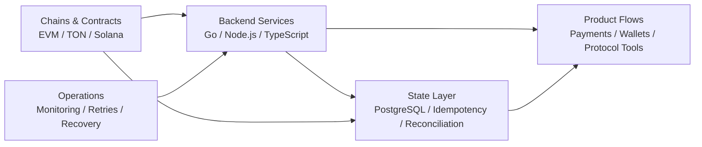

<p align="center">
  
</p>

<p align="center">
  <a href="https://github.com/CornersOfTheCity?tab=repositories"></a>
  <a href="https://github.com/CornersOfTheCity?tab=repositories&q=&type=&language=solidity&sort="></a>
  <a href="https://github.com/CornersOfTheCity?tab=repositories&q=&type=&language=go&sort="></a>
  <a href="https://github.com/CornersOfTheCity?tab=repositories&q=&type=&language=typescript&sort="></a>
</p>

<h3 align="center">Web3 backend engineer building payment, wallet, contract, and on-chain data systems.</h3>

<p align="center">
  I work mostly on backend infrastructure for Web3 products: service APIs, transaction state machines,
  event scanners, contract integrations, and the operational glue between users, databases, and chains.
</p>

---

### What I Build

Most production and organization work is not fully represented by public repositories, so this profile is a technical map rather than a complete project inventory.

```txt
Backend Services       Go / Node.js / TypeScript APIs, workers, payment and wallet flows
On-chain Indexing      Event scanners, block/log polling, idempotent processing, DB persistence
Contract Integration   ABI calls, deployment scripts, verification, testnet/mainnet operations
Smart Contracts        Solidity, Foundry, Hardhat, Tact/TON experiments, protocol prototypes
Reliability Mindset    State consistency, retry design, confirmation tracking, failure recovery
```

### Focus

```txt
Payment Backends       Scan-code payment flows, order states, chain confirmations
Wallet Infrastructure  Account flows, asset movement, contract/service boundaries
Data Pipelines         Chain event ingestion, normalized storage, backend reconciliation
Protocol Research      ZK privacy contracts, Merkle trees, DeFi incident reproduction
```

### Toolkit

<p>
  
  
  
  
  
  
  
  
  
  
  
</p>

### Backend & Protocol Experience

<table>
  <tr>
    <td width="50%">
      <h3>Payment & Wallet Backends</h3>
      <p>Backend flows for scan-code payments, wallet-related state, transaction lifecycle tracking, and service-side chain integration.</p>
      <p><code>Go</code> <code>Node.js</code> <code>PostgreSQL</code> <code>Payments</code></p>
    </td>
    <td width="50%">
      <h3>On-chain Data Services</h3>
      <p>Event scanners and indexing services that turn contract logs, chain state, and confirmations into queryable backend data.</p>
      <p><code>TypeScript</code> <code>TON</code> <code>Indexers</code> <code>Workers</code></p>
    </td>
  </tr>
  <tr>
    <td width="50%">
      <h3>Contract Engineering</h3>
      <p>Solidity contract workspaces, deployment scripts, verification flows, Foundry/Hardhat testing, and backend-facing contract calls.</p>
      <p><code>Solidity</code> <code>Foundry</code> <code>Hardhat</code> <code>EVM</code></p>
    </td>
    <td width="50%">
      <h3>Protocol Research</h3>
      <p>ZK privacy contract implementation notes, Merkle tree mechanics, Circom/Groth16 workflows, and DeFi incident reproduction practice.</p>
      <p><code>Circom</code> <code>snarkjs</code> <code>Merkle Trees</code> <code>Security Research</code></p>
    </td>
  </tr>
</table>

### Public Samples

<table>
  <tr>
    <td width="50%">
      <h3><a href="https://github.com/CornersOfTheCity/ScanCodePay">ScanCodePay</a></h3>
      <p>Go backend sample for scan-code payment flow design and transaction-side service logic.</p>
    </td>
    <td width="50%">
      <h3><a href="https://github.com/CornersOfTheCity/JapanMallScan">JapanMallScan</a></h3>
      <p>TypeScript service for scanning Tact contract event logs on TON with PostgreSQL configuration.</p>
    </td>
  </tr>
  <tr>
    <td width="50%">
      <h3><a href="https://github.com/CornersOfTheCity/GUGUContracts">GUGUContracts</a></h3>
      <p>Solidity contract workspace using Foundry-style development, build, test, and deployment workflows.</p>
    </td>
    <td width="50%">
      <h3><a href="https://github.com/CornersOfTheCity/tornadocash-core">tornadocash-core</a></h3>
      <p>ZK contract research project covering circuits, verifier generation, deployment, and testing notes.</p>
    </td>
  </tr>
</table>

### Project Map



### GitHub Signals

<p align="center">
  
  
</p>

<p align="center">
  
</p>

---

<p align="center">
  <sub>Building backend infrastructure for products that need to survive real on-chain state.</sub>
</p>
