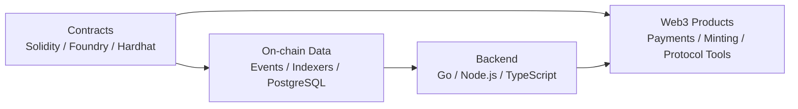

<p align="center">
  
</p>

<p align="center">
  <a href="https://github.com/CornersOfTheCity?tab=repositories"></a>
  <a href="https://github.com/CornersOfTheCity?tab=repositories&q=&type=&language=solidity&sort="></a>
  <a href="https://github.com/CornersOfTheCity?tab=repositories&q=&type=&language=go&sort="></a>
  <a href="https://github.com/CornersOfTheCity?tab=repositories&q=&type=&language=typescript&sort="></a>
</p>

<h3 align="center">Smart contracts, backend services, and protocol experiments for Web3 products.</h3>

<p align="center">
  I work across EVM contracts, Go services, TypeScript indexers, payment flows, and on-chain data pipelines.
  My favorite problems live at the boundary between contract correctness and reliable backend infrastructure.
</p>

---

### Focus

```txt
Smart Contracts     Solidity, Foundry, Hardhat, deployment scripts, test workflows
Backend Systems     Go, Node.js, TypeScript, APIs, workers, PostgreSQL-backed services
On-chain Data       Event scanners, chain integrations, indexing, payment state tracking
Protocol Research   ZK privacy contracts, Merkle trees, DeFi incident reproduction
```

### Toolkit

<p>
  
  
  
  
  
  
  
  
  
  
  
</p>

### Selected Work

<table>
  <tr>
    <td width="50%">
      <h3><a href="https://github.com/CornersOfTheCity/GUGUContracts">GUGUContracts</a></h3>
      <p>Solidity contract workspace for the GUGU ecosystem, using a Foundry-style development flow for build, test, and deployment tasks.</p>
      <p><code>Solidity</code> <code>Foundry</code> <code>EVM</code></p>
    </td>
    <td width="50%">
      <h3><a href="https://github.com/CornersOfTheCity/ScanCodePay">ScanCodePay</a></h3>
      <p>Go backend project around scan-code payment flows, useful for payment orchestration, transaction state, and service-side integration.</p>
      <p><code>Go</code> <code>Payments</code> <code>Backend</code></p>
    </td>
  </tr>
  <tr>
    <td width="50%">
      <h3><a href="https://github.com/CornersOfTheCity/JapanMallScan">JapanMallScan</a></h3>
      <p>TypeScript scanner for Tact contract event logs on TON, with endpoint, contract, API key, and PostgreSQL configuration.</p>
      <p><code>TypeScript</code> <code>TON</code> <code>Indexer</code> <code>PostgreSQL</code></p>
    </td>
    <td width="50%">
      <h3><a href="https://github.com/CornersOfTheCity/tornadocash-core">tornadocash-core</a></h3>
      <p>ZK privacy contract implementation notes covering Merkle trees, Circom circuits, Groth16 setup, verifier generation, and Sepolia deployment.</p>
      <p><code>JavaScript</code> <code>Hardhat</code> <code>Circom</code> <code>snarkjs</code></p>
    </td>
  </tr>
</table>

### Project Map



### GitHub Signals

<p align="center">
  
  
</p>

<p align="center">
  
</p>

---

<p align="center">
  <sub>Building contract logic and backend infrastructure for products that need to survive real on-chain state.</sub>
</p>
